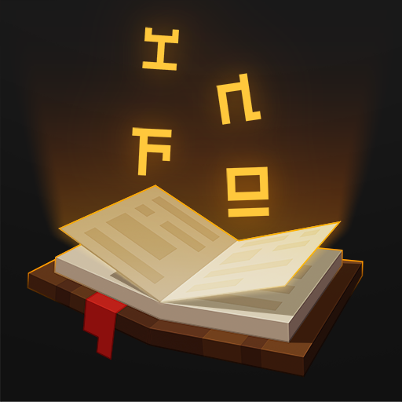

  

<h1 align="center">
  Enchantment Info
   
   
  

    
    
    
  

</h1>

 

Client-side mod for Fabric, Forge and NeoForge.
Extends Enchanted Book's tooltip with what its Enchantments conflict with and what they can be applied to.

Works with Enchantments and items from other mods and datapacks, because all info is read from the game.

## How to read it

Info is shown while <kbd>Shift</kbd> is held.

Under an Enchantment's name:
- **Red line with names:** Enchantments it conflicts with.
- **Green line with icons:** what it can be applied to.
  Silhouettes are item categories, like all pickaxes or all items with durability. Regular icons are items outside of these categories.
- **Red line with icons:** items of these categories it can't be applied to.
  A category is shown when most of its items fit, the rest are listed here.

An icon that keeps changing stands for several items from one tag.

**Groups.** When Enchantments of one book have info in common, they are grouped, and a blue line on the left joins the group.
Lines inside it belong to a single Enchantment, lines right after it belong to every Enchantment of the group.
Enchantments with exactly the same info are listed together under one blue line, followed by their info.
